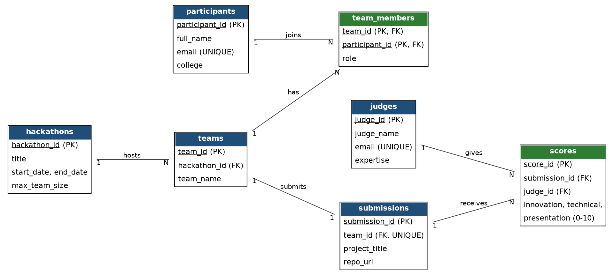

# 🏆 Hackathon Management System

A database-driven application to manage hackathons, teams, project submissions and judge scoring. Built as a DBMS mini project.

**Stack:** MySQL 8 · Python 3 · Streamlit

## Features
- **CRUD** for participants, hackathons, teams, submissions, judges and scores
- 7 normalized tables (3NF) with PK, FK, UNIQUE and CHECK constraints
- **Triggers** – `trg_team_full` (max team size) and `trg_one_team_per_hackathon` (a participant can join only one team per hackathon)
- **Stored procedure + transaction** `register_team` – creates a team and its leader together (rolls back on error)
- **Views** – `v_team_sizes` and `v_leaderboard` (average of all judges' scores, uses `RANK()`)
- **SQL Reports** page with JOIN, GROUP BY, LEFT JOIN and subquery examples

## Project structure
```
hackathon-dbms/
├── app.py            # Streamlit UI
├── schema.sql        # tables, views, triggers, stored procedure
├── sample_data.sql   # demo data
├── requirements.txt
├── docs/             # ER diagram + project report (PDF)
└── screenshots/
```

## Database setup
```bash
mysql -u root -p < schema.sql
mysql -u root -p < sample_data.sql
```
This creates the database `hackathon_db` with sample data.

## Run the app
```bash
pip install -r requirements.txt
export DB_USER=root
export DB_PASSWORD=your_password     # Windows CMD: set DB_PASSWORD=your_password
streamlit run app.py
```
Optional: `DB_HOST` (default `localhost`), `DB_NAME` (default `hackathon_db`).

## Run online (no local installation)
1. Create a free MySQL service on [Aiven](https://aiven.io) and note the host, port, user and password.
2. Push this repo to GitHub, then deploy `app.py` on [Streamlit Community Cloud](https://streamlit.io/cloud).
3. In the app's **Secrets** settings add (never commit passwords to GitHub):
   ```toml
   DB_HOST = "your-aiven-host"
   DB_PORT = "your-port"
   DB_USER = "avnadmin"
   DB_PASSWORD = "your-password"
   ```
4. Open the app, expand **First-time setup** in the sidebar and click **Create database**. This runs `schema.sql` and `sample_data.sql` for you.

## ER diagram


## Screenshots
Add screenshots in the `screenshots/` folder.
